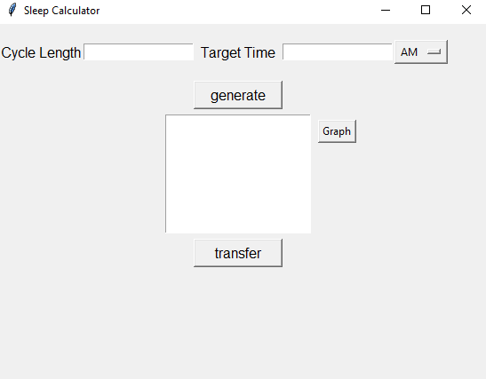
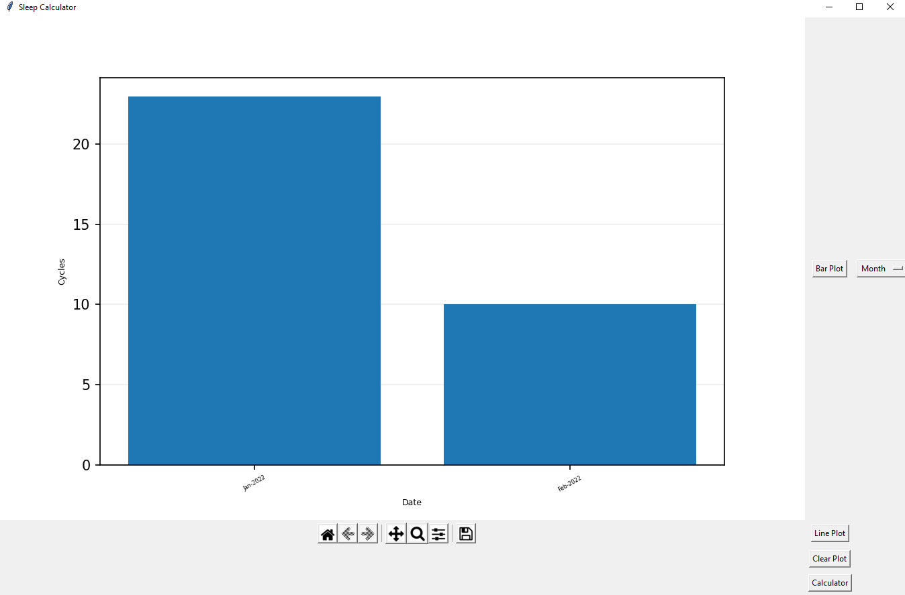

# sleep-tracker

Simple GUI that calculates what time you should sleep and keeps track of your sleep everyday with a CSV file

(if you leave target time blank, then script will generate times of when you should wake up given you sleep at that momemt)

Transfer button will input your sleep time, wake up time, # of cycles, and cycle length
